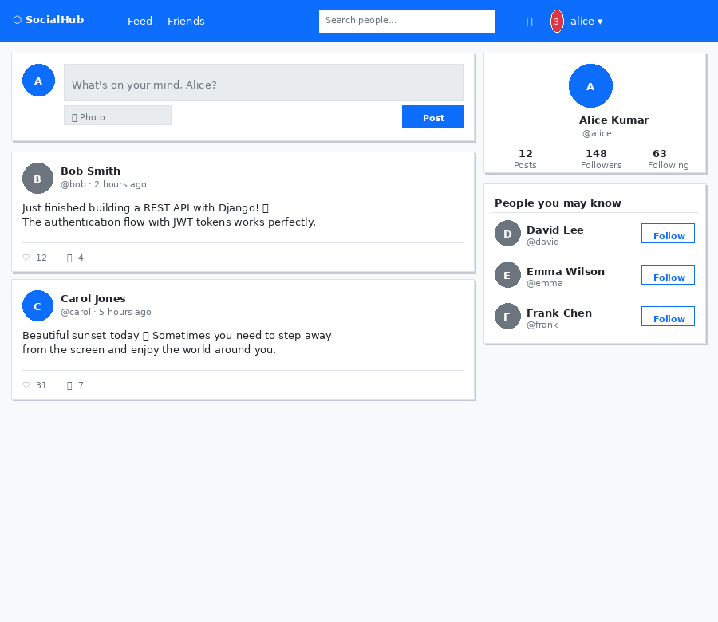
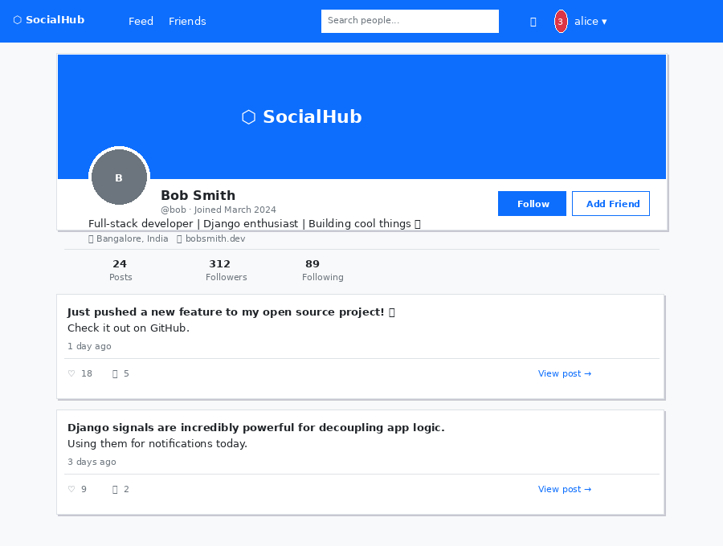
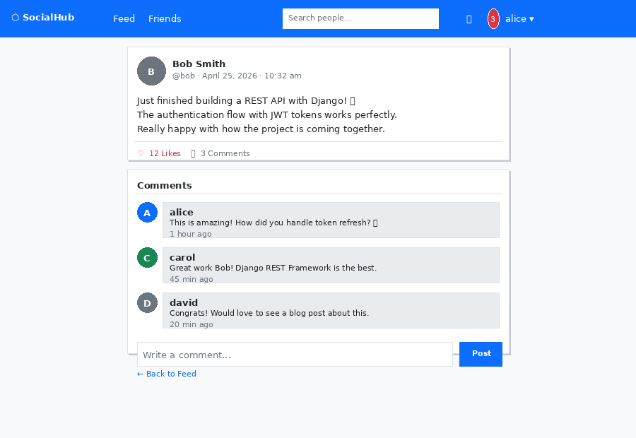
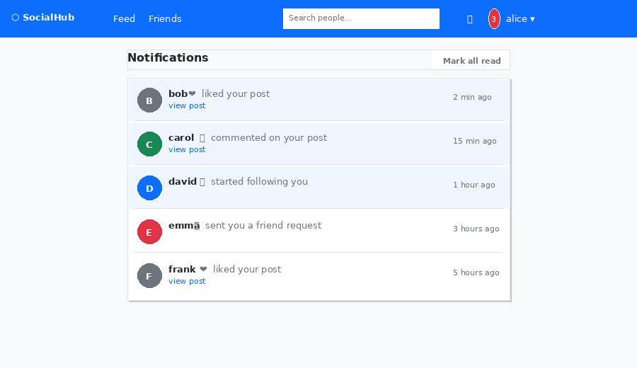
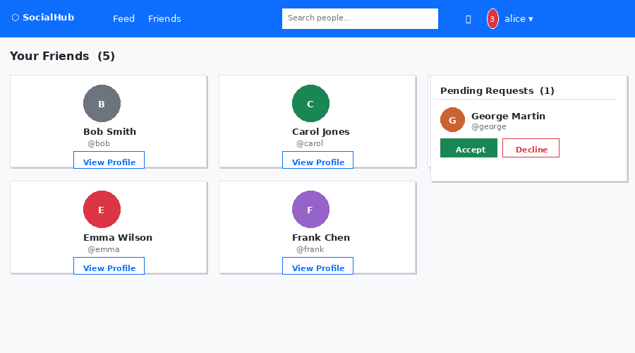
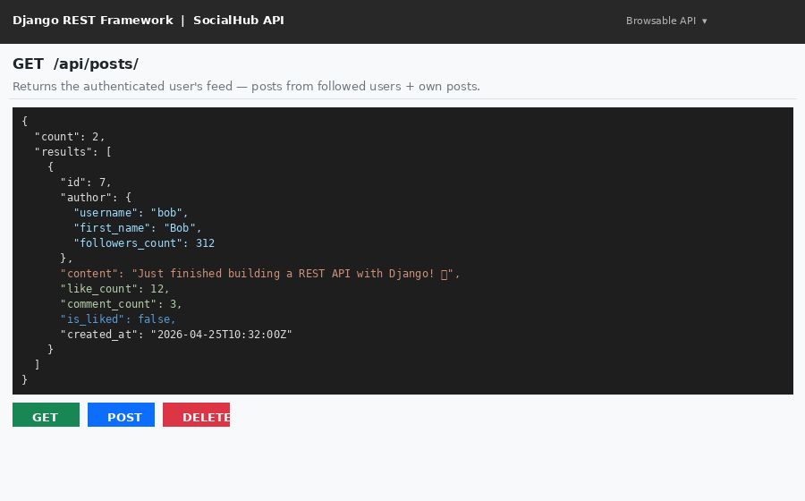
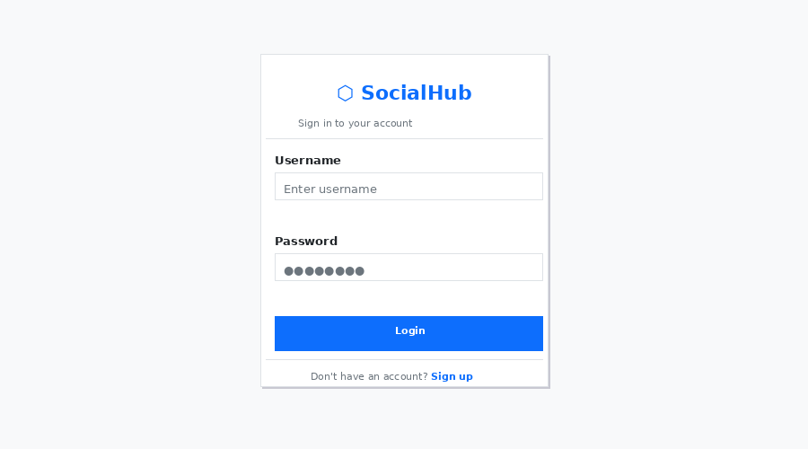

# ⬡ SocialHub — Django Social Media Platform


A full-featured social media web application built with Django and Django REST Framework,
featuring user profiles, posts with likes and comments, a follow/friend system,
real-time-style notifications, and a complete REST API — all wrapped in a responsive
Bootstrap 5 interface.

---

## 📸 Screenshots

### Feed


### User Profile


### Post Detail & Comments


### Notifications


### Friends


### REST API (Browsable)


### Login


---

## ✨ Features

| Feature | Details |
|---|---|
| 🔐 **Authentication** | Register, login, logout with Django's built-in auth system |
| 👤 **User Profiles** | Bio, profile picture, cover photo, location, website |
| 📝 **Posts** | Create posts with optional image upload, edit, delete |
| ❤️ **Likes** | Toggle likes via AJAX — no page reload required |
| 💬 **Comments** | Add and delete comments on any post |
| 👥 **Follow System** | Follow/unfollow users, view followers and following lists |
| 🤝 **Friend Requests** | Send, accept, and decline friend requests |
| 🔔 **Notifications** | Alerts for likes, comments, follows, and friend requests |
| 🔍 **User Search** | Search by username, first name, or last name |
| 💡 **Suggestions** | "People you may know" recommendations on feed and sidebar |
| 🌐 **REST API** | Full DRF API with session authentication and pagination |
| ⚙️ **Admin Panel** | Django admin for all models with search and filters |

---

## 🧰 Tech Stack

| Layer | Technology |
|---|---|
| **Backend** | Python 3.10+, Django 4.2, Django REST Framework 3.14 |
| **Frontend** | Bootstrap 5.3, Bootstrap Icons, Vanilla JavaScript (AJAX likes) |
| **Database** | SQLite (development) · PostgreSQL (production) |
| **Media & Static** | Pillow for image handling, WhiteNoise for static file serving |
| **Deployment** | Gunicorn WSGI server, python-decouple for environment config |
| **Testing** | Django TestCase — models, views, and feed logic |

---

## 🏗️ Project Architecture

The project is split into focused Django apps — each responsible for one domain:

```
social_platform/
├── users/           # Registration, login, profiles, search, suggestions
├── posts/           # Post creation, feed, likes (AJAX), comments, delete
├── friends/         # Follow/unfollow, friend requests, accept/decline
├── notifications/   # Notification model, context processor, unread badge
├── api/             # Django REST Framework — serializers, API views, endpoints
├── templates/       # HTML templates (base, feed, profile, notifications, etc.)
├── static/          # CSS (style.css) and JS (main.js — alerts, char counter)
└── tests/           # Model tests, view tests, feed logic tests
```

| App | Responsibility |
|---|---|
| `users` | Auth, UserProfile model (OneToOne with User), profile editing |
| `posts` | Post + Comment models, feed query (followed users + self) |
| `friends` | Follow + FriendRequest models, toggle follow, request flow |
| `notifications` | Notification model, context processor for unread count badge |
| `api` | DRF serializers and views — mirrors all core features as JSON endpoints |

---

## ⚙️ Setup

### Prerequisites
- Python 3.10+
- pip

### Installation

```bash
# 1. Clone the repository
git clone https://github.com/your-username/social-platform.git
cd social_platform

# 2. Create and activate a virtual environment
python -m venv venv
source venv/bin/activate        # Windows: venv\Scripts\activate

# 3. Install dependencies
pip install -r requirements.txt

# 4. Set up environment variables
cp .env.example .env
# Open .env and set your SECRET_KEY, DEBUG, and ALLOWED_HOSTS

# 5. Apply database migrations
python manage.py migrate

# 6. Create a superuser (for Django admin)
python manage.py createsuperuser

# 7. Start the development server
python manage.py runserver
```

Visit **http://127.0.0.1:8000** to open the app.
Django Admin is available at **http://127.0.0.1:8000/admin/**

### Environment Variables (`.env`)

```env
SECRET_KEY=your-secret-key-here
DEBUG=True
ALLOWED_HOSTS=localhost,127.0.0.1
```

---

## 🌐 API Endpoints

All endpoints require session authentication. Base URL: `/api/`

| Method | Endpoint | Description |
|---|---|---|
| `GET` `POST` | `/api/posts/` | List feed posts or create a new post |
| `GET` `DELETE` | `/api/posts/<id>/` | Retrieve or delete a specific post |
| `POST` | `/api/posts/<id>/like/` | Toggle like on a post |
| `GET` `POST` | `/api/posts/<id>/comments/` | List or add comments |
| `GET` | `/api/users/` | List users (supports `?q=` search) |
| `GET` | `/api/users/<username>/` | Retrieve a user profile |
| `POST` | `/api/users/<username>/follow/` | Toggle follow on a user |

**Example response — `GET /api/posts/`:**
```json
{
  "count": 2,
  "results": [
    {
      "id": 7,
      "author": { "username": "bob", "followers_count": 312 },
      "content": "Just finished building a REST API with Django!",
      "like_count": 12,
      "comment_count": 3,
      "is_liked": false,
      "created_at": "2026-04-25T10:32:00Z"
    }
  ]
}
```

---

## 🧪 Running Tests

```bash
python manage.py test tests/
```

Tests cover:
- UserProfile auto-creation via signals
- Post like count, comment count, ordering
- Follow uniqueness constraint
- Feed view — shows own posts, followed posts, hides unfollowed posts
- Feed redirects unauthenticated users

---

## 🚀 Production Deployment

```bash
# Collect static files (WhiteNoise serves them)
python manage.py collectstatic

# Run with Gunicorn
gunicorn social_platform.wsgi:application --bind 0.0.0.0:8000
```

Key production settings already configured:
- **WhiteNoise** — serves and compresses static files without a separate web server
- **python-decouple** — keeps secrets out of source code via `.env`
- **DEBUG=False** — set in `.env` before deploying
- **PostgreSQL** — swap DATABASES in settings.py for production

---

## 🔮 Future Enhancements

- [ ] Real-time chat using Django Channels + WebSockets
- [ ] Live notifications with WebSocket push (no polling)
- [ ] Post sharing and reposting
- [ ] Hashtag support and trending topics
- [ ] Email verification on registration
- [ ] OAuth login (Google, GitHub)
- [ ] Docker + docker-compose setup for one-command deploy
- [ ] Deploy to Railway / Render with PostgreSQL

---

## 👤 Author

Developed as the capstone project for **Month 2 — Django Web Development**.

- GitHub: [BBRAO-ERRIPAP](https://github.com/BBRAO-ERRIPAP)